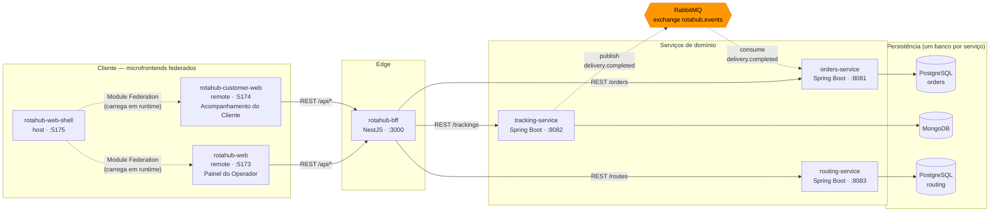
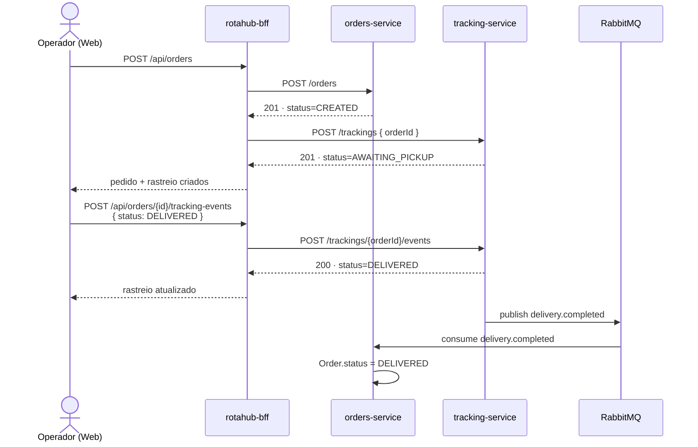

# rotahub-infra

Orquestração local e documentação de arquitetura do RotaHub. Não contém código de aplicação —
esse repositório é a "cola" entre os outros.

## Arquitetura



Três mecanismos diferentes, três traços diferentes: pontilhado cinza é composição de UI em
runtime (Module Federation — o shell nem sabe o conteúdo dos remotes até carregar); sólido é
REST síncrono; tracejado laranja é o único ponto de comunicação assíncrona do sistema (evento via
RabbitMQ). Nenhum serviço lê o banco de outro — só via API ou evento. O `routing-service` está
integrado de ponta a ponta, com a tela "Planejar rota" no Painel do Operador.

## Fluxo completo de um pedido



A criação do pedido e do rastreio é síncrona — o operador espera a resposta. O fechamento
(`DELIVERED`) não é: o `tracking-service` publica o evento e segue em frente; o `orders-service`
reage quando processa a mensagem, sem que ninguém tenha pedido isso diretamente.

O Acompanhamento do Cliente segue o mesmo padrão de leitura, trocando `GET /api/orders/{id}` por
`GET /api/orders/by-tracking-code/{trackingCode}` — o cliente final não conhece o UUID interno,
só o código impresso na etiqueta.

## Repositórios do RotaHub

| Repositório | Stack | Papel |
|---|---|---|
| [`orders-service`](https://github.com/ericsonscodeler/rotahub-orders-service) | Java 21 · Spring Boot 4.1 · PostgreSQL | Dono do pedido |
| [`tracking-service`](https://github.com/ericsonscodeler/rotahub-tracking-service) | Java 21 · Spring Boot 4.1 · MongoDB | Dono do rastreio |
| [`routing-service`](https://github.com/ericsonscodeler/rotahub-routing-service) | Java 21 · Spring Boot 4.1 · PostgreSQL | Otimização de rotas (vizinho mais próximo) |
| [`rotahub-bff`](https://github.com/ericsonscodeler/rotahub-bff) | Node · NestJS | Orquestração REST pra UI |
| [`rotahub-web`](https://github.com/ericsonscodeler/rotahub-web) | React · Vite · Tailwind | Painel do Operador (remote federado) |
| [`rotahub-customer-web`](https://github.com/ericsonscodeler/rotahub-customer-web) | React · Vite · Tailwind | Acompanhamento do Cliente (remote federado) |
| [`rotahub-web-shell`](https://github.com/ericsonscodeler/rotahub-web-shell) | React · Vite · Module Federation | Host que carrega os dois remotes |
| `rotahub-infra` | Docker Compose | Este repositório |

Todos os 8 repositórios têm CI (GitHub Actions) rodando build + testes a cada push na `main`.

Contrato completo dos endpoints e do payload do evento: [`docs/contracts.md`](docs/contracts.md).

## Rodando localmente

Clone os 8 repositórios como pastas irmãs (mesmo diretório pai) e suba a infraestrutura:

```bash
cd rotahub-infra
docker compose up -d   # Postgres orders :5432, Postgres routing :5433, MongoDB :27017, RabbitMQ :5672 (management :15672)
```

Em terminais separados:

```bash
cd orders-service       && ./mvnw spring-boot:run             # :8081
cd tracking-service      && ./mvnw spring-boot:run             # :8082
cd routing-service       && ./mvnw spring-boot:run             # :8083
cd bff                   && npm install && npm run start:dev  # :3000
cd rotahub-web            && npm install && npm run dev        # :5173 (remote)
cd rotahub-customer-web   && npm install && npm run dev        # :5174 (remote)
cd rotahub-web-shell      && npm install && npm run dev        # :5175 (host)
```

Abra `http://localhost:5175` (shell, com navegação entre os dois microfrontends) — ou acesse
`rotahub-web`/`rotahub-customer-web` direto nas portas 5173/5174 pra rodá-los standalone.

Collections prontas pra testar os endpoints manualmente: `rotahub.postman_collection.json`
(Postman/Insomnia/Bruno) ou a pasta `RotaHub/` (Bruno nativo).
