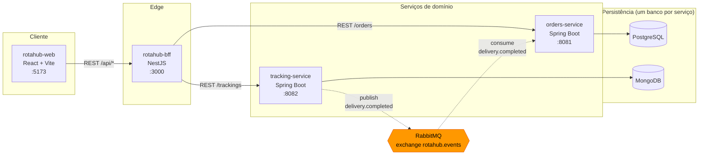
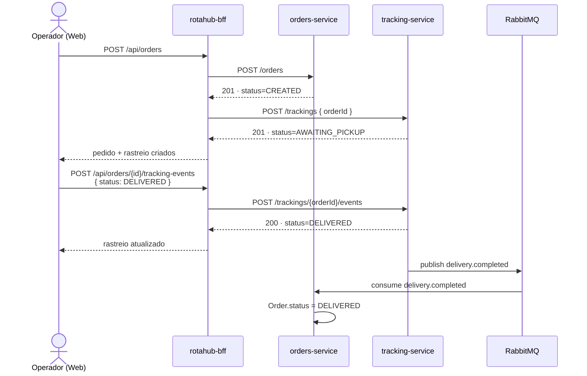

# rotahub-infra

Orquestração local e documentação de arquitetura do RotaHub. Não contém código de aplicação —
esse repositório é a "cola" entre os outros quatro.

## Arquitetura



Setas sólidas são REST síncrono; a tracejada laranja é o único ponto de comunicação assíncrona
do sistema. Nenhum serviço lê o banco de outro — só via API ou evento.

## Fluxo completo de um pedido



A criação do pedido e do rastreio é síncrona — o operador espera a resposta. O fechamento
(`DELIVERED`) não é: o `tracking-service` publica o evento e segue em frente; o `orders-service`
reage quando processa a mensagem, sem que ninguém tenha pedido isso diretamente.

### Status de implementação

| Trecho do fluxo | Status |
|---|---|
| `orders-service` — CRUD de pedidos | ✅ Implementado e testado |
| `tracking-service` — rastreio + publicação do evento | ✅ Implementado e testado |
| `orders-service` — consumo de `delivery.completed` | ✅ Implementado e testado |
| `rotahub-bff` → `orders-service` | ✅ Implementado e testado |
| `rotahub-bff` → `tracking-service` | ⏳ Pendente — BFF hoje só orquestra pedidos, o diagrama acima mostra o alvo do `docs/contracts.md` |
| `rotahub-web` — exibir status/timeline de rastreio | ⏳ Pendente — depende do item acima |

## Repositórios do RotaHub

| Repositório | Stack | Papel |
|---|---|---|
| [`orders-service`](https://github.com/ericsonscodeler/rotahub-orders-service) | Java 21 · Spring Boot 4.1 · PostgreSQL | Dono do pedido |
| [`tracking-service`](https://github.com/ericsonscodeler/rotahub-tracking-service) | Java 21 · Spring Boot 4.1 · MongoDB | Dono do rastreio |
| [`rotahub-bff`](https://github.com/ericsonscodeler/rotahub-bff) | Node · NestJS | Orquestração REST pra UI |
| [`rotahub-web`](https://github.com/ericsonscodeler/rotahub-web) | React · Vite · Tailwind | Painel do Operador |
| `rotahub-infra` | Docker Compose | Este repositório |

Contrato completo dos endpoints e do payload do evento: [`docs/contracts.md`](docs/contracts.md).

## Rodando localmente

Clone os 5 repositórios como pastas irmãs (mesmo diretório pai) e suba a infraestrutura:

```bash
cd rotahub-infra
docker compose up -d   # Postgres :5432, MongoDB :27017, RabbitMQ :5672 (management :15672)
```

Em terminais separados:

```bash
cd orders-service    && ./mvnw spring-boot:run     # :8081
cd tracking-service   && ./mvnw spring-boot:run     # :8082
cd bff                && npm install && npm run start:dev   # :3000
cd rotahub-web        && npm install && npm run dev          # :5173
```

Abra `http://localhost:5173`. Collections prontas pra testar os endpoints manualmente:
`rotahub.postman_collection.json` (Postman/Insomnia/Bruno) ou a pasta `RotaHub/` (Bruno nativo).
